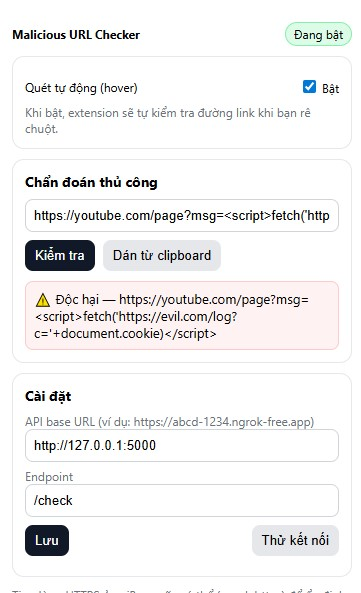
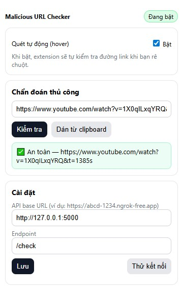
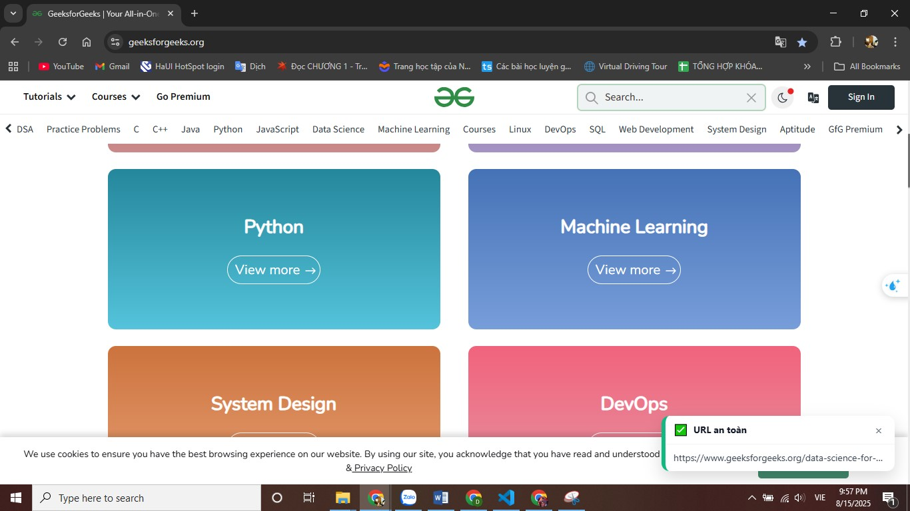

# ĐỒ ÁN CHUYÊN NGÀNH
# ĐỀ TÀI: XÂY DỰNG HỆ THỐNG CẢNH BÁO URL ĐỘC HẠI SỬ DỤNG MÔ HÌNH LSTM VÀ BERT


---

## 📁 Cấu trúc dự án

```
|   Bert_model.ipynb
|   Lstm_model.ipynb
|   Readme.md
|
+---backend_predict
|       api.py
|       output(kaggle)
|
+---extension
|   |   background.js
|   |   content.js
|   |   manifest.json
|   |   popup.html
|   |   popup.js
|   |   styles.css
|   |
|   \---icons
|           icon128.png
|           icon16.png
|           icon32.png
|           icon48.png
|
\---Image
        1.jpg
        2.jpg
        3.jpg
```

---

## 🧠 Model Overview

- **Base model:** `bert-base-uncased` từ HuggingFace
- **Input:** Raw URL strings
- **Output:** 0 (Benign), 1 (Malicious)

---

## 🚀 Getting Started

### 1. Clone the repository

```bash
git clone https://github.com/ZACZ1NH0/DACN.git
cd DACN
```
### 3. Tải output của model
Truy cập đường link để tải output và đưa vào backend_predict để chạy backend api
`https://www.kaggle.com/code/zodiacnguyenlongvu/editbert0001`

### 3. Chạy API để dự đoán

```bash
python backend_predict/api.py
```

API backend sẽ tồn tại: 
👉 `http://127.0.0.1:5000/check` để test

---
### 4. Upload extension
1. Vào quản lý extension trong trình duyệt
2. Bật develop mode
3. Vào phần tiện ích đã giải nén 
4. Chọn folder extension 
### 5. Demo

#### 🔹 Dự đoán thủ công với URL an toàn



#### 🔹 Dự đoán thủ công với URL độc hại



#### 🔹 Dự đoán tự động từ API

